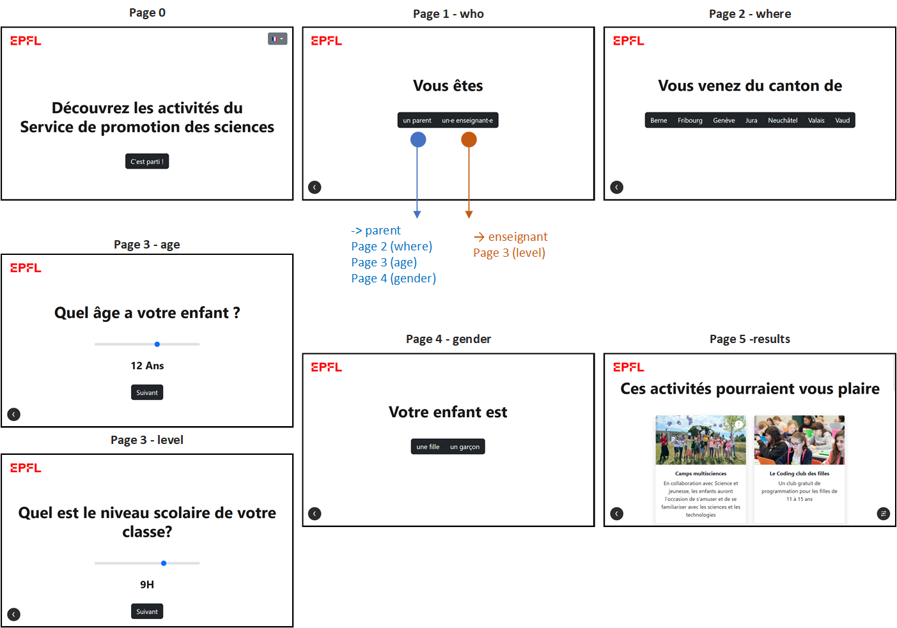
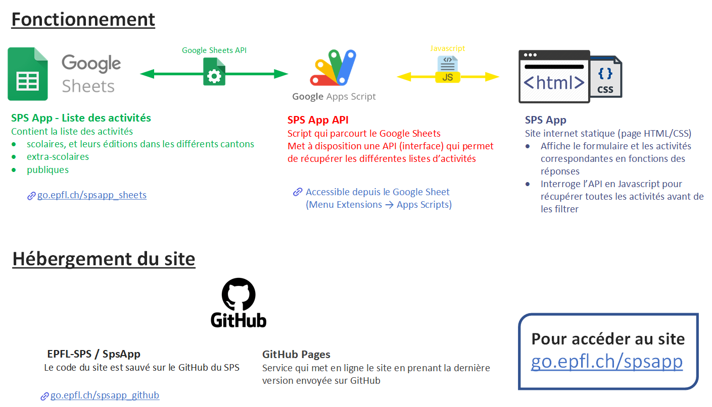

# SPS App

> Découvrir le site sur  [go.epfl.ch/spsapp](https://go.epfl.ch/spsapp)

Site internet qui présente les activités du Service de promotion des sciences (SPS) de l'EPFL.

Le site est accessible en deux langues (français/allemand) et présente les activités scolaires, extra-scolaires et grand public du SPS.

# Utilisation
Au démarrage, l'utilisateur est invité à répondre à des questions.

En fonction de s'il s'agit d'un parent ou d'un.e enseignant.e les informations demandées varient. 

Une fois sur la page finale, l'utilisateur découvre les activités qui correspondent à ses réponses. On lui présente également des activités grand public.

Pour éviter de repasser sut toutes les questions, le bouton `Filtres` (en bas à droite) permet de modifier les critères de recherche directement depuis la page des résultats.

Un bouton `Retour` (en bas à gauche) permet de revenir en arrière.

A noter que sur la première page, l'utilisateur peut changer de langue (en haut à droite).

# Modifier la liste des activités
> Google Sheets - Liste des activités (accessible par toutes les personnes de l'organisation SPS) [go.epfl.ch/spsapp_sheets](https://go.epfl.ch/spsapp_sheets)

Les activités sont répertoriées sur un Google Sheet.

Pour les activités extra-scolaires, la logique est la suivante :
- Les activités extra-scolaires sont répertoriées dans une feuille `Extra-scolaire - Activités`. Chacune d'entre elle a un nom, une description, une image d'illustration et un format. Les activités sont identifiées par un public cible (age minimum et maximum, genre et langue) qui servira pour les filtres.
- Pour qu'une activité extra-scolaire apparaisse dans les résultats de recherche, il doit exister une édition qui corresponde. Pour ce faire, la feuille `Extra-scolaire - Éditions` liste les éditions de chaque activité dans les différents cantons. En plus des informations propres à son activité mère, une édition contient une information sur la période à laquelle elle a lieu. A noter que seules les éditions indiquées comme `Disponible` seront affichées.
- La colonne `Remarque`, autant pour les activités que les éditions, premet d'ajouter une information complémentaire qui sera affichée dans une pop-up au clic sur un résultat de recherche.

En plus des activités extra-scolaires, une feuille `Scolaire - Activités` liste les activités scolaires. Son fonctionnement est similaires aux activités extra-scolaires hormis que le public cible est défini par le niveau scolaire et la langue de l'activité. 

De même, une feuille `Grand public - Activités` liste les évènements grand public qui sont quant à eux uniquement filtrés en fonction de la langue de l'utilisateur. 

# Fonctionnement technique

La site internet a été pensé comme un site statique qui ne nécessite pas de serveur. Il peut simplement être lancé en local en ouvrant le fichier [index.html](/index.html) dans un navigateur.

Pour récupérer la liste des activités et leurs images, l'ordinateur/tablette sur lequel le site est lancé doit cependant être connecté à internet.

> A noter que le site est également hébergé en ligne pour faciliter son utilisation, se référer aux chapitres ci-dessous pour plus de détails. 

## Architecture générale

> Les explications détaillées pour chaque bloc sont présentées plus bas

## SPS App API

Pour faire le lien entre le Google Sheets et le site, une API a été développée. Concrètement, elle permet au site de faire une requête en Javascript pour récupérer les différentes listes d'activités. Cette API a été faite avec [Google Apps Script](https://developers.google.com/apps-script?hl=fr), il s'agit d'un outil intégré à Google Sheets qui permet de développer du code pour parcourir les données d'un classeur. Ce code utilise l'[API de Google Sheets](https://developers.google.com/sheets/api/guides/concepts?hl=fr).

Le code développée pour l'API est dans le dossier [/backend/AppsScript/api.gs](/backend/AppsScript/api.gs). Une fois déployée, Apps Script met à disposition une URL (spécifée dans [db.js](./js/db.js)) qui permet d'appeler l'API développée. 

## Hébergement du site en ligne
Le code du site est stocké sur le GitHub du SPS.

> Repository SPS App sur GitHub [go.epfl.ch/spsapp_github](https://go.epfl.ch/spsapp_github)

Pour héberger le site en ligne, il a été décidé d'utiliser Netlify. C'est un service qui permet d'héberger des sites statiques et de les déployer automatiquement à chaque modification sur GitHub.

> Déploiements du site sur Netlify [go.epfl.ch/spsapp_netlify](https://go.epfl.ch/spsapp_netlify)

Netlify met à disposition une URL qui permet d'accéder au site: [https://spsapp.netlify.app](https://spsapp.netlify.app), c'est sur cette URL qu'est redirigé le lien court [go.epfl.ch/spsapp](https://go.epfl.ch/spsapp)

# Code Javascript
Le site a été développé en Javascript, il utilise JQuery pour simplifier l'utilisation du langage. Boostrap a été utilisé pour faciliter la mise en page.

## Structure du code
Le code Javascript est divisé en plusieurs fichiers. Le script principal est à la racine du site et les autres fichiers sont dans le dossier [/js](/js):
- [script.js](./js/script.js) Script principal exécuté au chargement du site, gère la logique des pages et l'affichage des résultats
- [db.js](./js/db.js) Contient le code pour récupérer les listes d'activités grâce à l'API
- [display.js](./js/display.js) Contient les fonctions liées à l'affichage des pages du site, des résultats et des différents éléments graphiques (menus des langues/filtres, boutons, ...)
- [events.js](./js/events.js) Contient les codes des évènements liés aux interactions de l'utilisateur pendant qu'il remplit le questionnaire
- [filters.js](./js/filters.js) Contient les fonctions de filtrage des résultats en fonction des réponses de l'utilisateur
- [filtersMenu.js](./js/filtersMenu.js) Contient le code relatif au menu des filtres accessible sur la page des résultats
- [language.js](./js/language.js) Contient le code qui gère la logique de changement de langue sur le site et la traduction des éléments 
- [templates.js](./js/templates.js) Contient les différents templates HTML et les fonctions pour les remplir avec des données
- [utils.js](./js/utils.js) Contient des fonctions utilitaires utilisées globalement
